# Notes on the estimation of causal relationships between taxa in paleoecological time series

## Objectives

We plan to understand the relationships between taxa, and how external factors have shaped these relationships throughout (*a considerable amount of*) time. We will make use of time series of vegetal taxa pollen's abundance. For this reason, we will have to do is to estimate the **causality** *between* the abundances of these species' pollen.

These causal relationships are the basis for the construction of a *network of interactions between taxa* which, ultimately, is our object of study. In particular, we want to build a time-varying network (i.e., a network where interactions and constituents vary over time)[[1]](#1).

Our ultimate goal is to study the evolution across time of the structural features of these networks and see whether they change significantly in response to external factors (e.g., glaciation, fire, or agriculture).

This being said, to achieve this goal we had to perform some *preliminary steps*. Let us go through them.

## ISSUE 1: converting *discrete* observations into *continuous* time series

Whatever method available to estimate causality between time series requires that their sampling (i.e., space between adjacent observations) is uniform. However, this requirement clashes with the fact that experimental data is seldom uniformly sampled.

To overcome this limitation, we have to *convert* our experimental (scattered) observations into a *continuous* time series. There are many interpolation methods but we decided to use the **Generalized Additive Models** [[2]](#2) (henceforth, GAM) available via the Python package named `pyGAM` [[3]](#3)[[4]](#4). GAM is a quite flexible method with (among other things) the advantage of over-fitting less than other methods (like, for instance, `spline()`). The figure below is an example of `spline()` over-fitting issue. We generated data following a polynomial function $y_t = \left(\alpha \, {x_t}^4 \right) \times \left(1 - x_t \right)^4 $ and added some Gaussian noise to it.

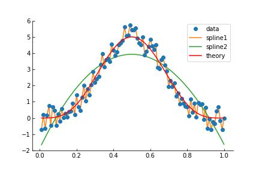

GAM, on the contrary, succeeds in extracting the correct behavior (see the figure below) (inspiration taken from [[5]](#5)).

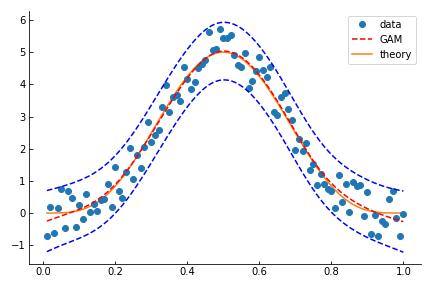

Nonetheless, to ensure the suitability of GAM for our purposes, we performed some tests involving both synthetic and experimental data. First, we considered a dataset of abbundance of Sardines and Anchovies (from [[6]](#6)).

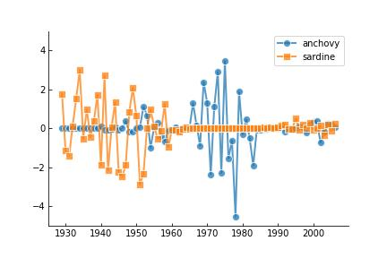

By applying GAM *tout-court*, the reconstruction of the time series is not very good.

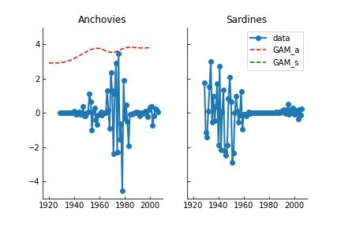

If, instead, we smooth the original data (using a moving window of size 4), and then we apply GAM, we get:

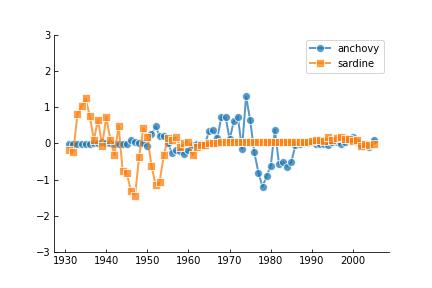
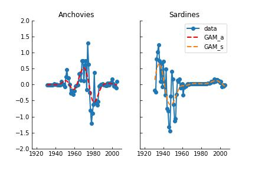

We have tested also GAM on a synthetic dataset containing different trends (inspiration taken from [[7]](#7)), namely:

1) Combination of different macroscopic trends (linear + periodic)
2) Presence of within- and cross- seasonal trends

The latter behavior is obtained via the following function:

$$
\begin{equation}
y(t) = \frac{1}{2} + \Biggl\{2 \cos\bigl(x_2(t)\bigr) \Biggl[ \frac{3}{4} \cos\bigl(x_1(t)\bigr)\Biggr]\Biggr\} \, e^{-\frac{x_1(t)}{8}}\,.
\end{equation}
$$

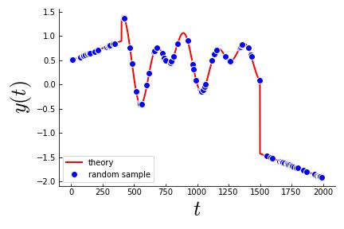

The application of GAM returns a pretty good approximation
 
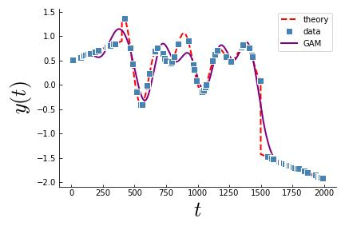

## Application of GAM to data from *Basa de la Mora*

We are now ready to convert our empirical discrete time series into continuous one via GAM. We use data from the _Basa de la Mora_ site [[8]](#8). In particular, we choose as benchmarks the following taxa:

- *Betula*
- *Pinus*
- *Corylus*
- *Artemisia*
- *Olea*

Whose abundances over time are:

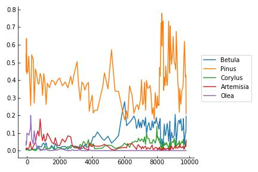

Applying GAM to these dataset gives:

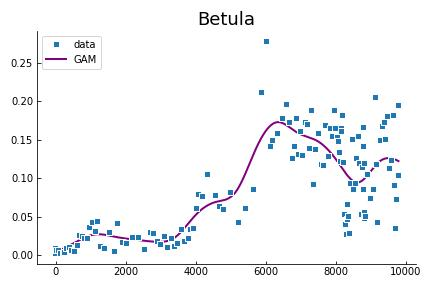
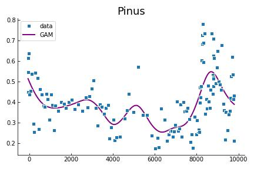

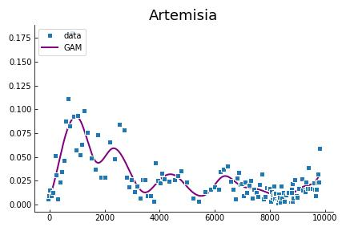
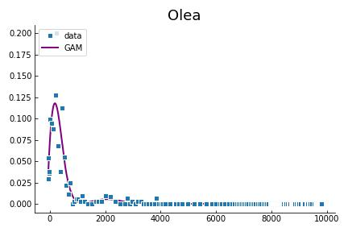

**Note:** It is worth noting that smoothing the data with moving average does not improve significantly the results (figures not shown).

## ISSUE 2: Estimating causal relationships

To generate networks of **interaction** between taxa we need to quantify the **causal relationships** (eventually) existing between their pollen's abbundances (i.e., time series). There are many methods available in the literature but we decided to evaluate the following ones:

- Convergent Cross Mapping (CCM) [[9]](#9)
- Granger Causality (GC) [[10]](#10)
- Transfer Entropy (TE) [[11]](#11)

However, as TE is a generalization of GC [[12]](#12), we ultimately decided to evaluate only CCM and TE. These methods have been applied in a plethora of case studies in ecology, neuroscience, economy, and climate science just to cite a few. Each method has *pros* and *cons*, and the works of Krakovská et al. [[13]](#13) and of Barraquand et al. [[14]](#14) provide an excellent benchmarking for these methods. In particular, from the work of Krakovská et al. [[13]](#13) it emerges that TE appears to be the most reliable method, due to its ability to return the smallest amount of false positive responses. In the following, we introduce briefly the main ideas behind these methods.

### Transfer Entropy (TE)

Transfer entropy (or conditional mutual information) -- Introduced by Schreiber in 2000 [[11]](#11) -- is a non-parametric statistic measuring the amount of directed (time-asymmetric) transfer of information between two stochastic processes. Given two stochastic processes $X \equiv \{ X_{t} \}$ and $Y \equiv \{ Y_{t} \}$ with $t \in \mathbb{N}$, the transfer entropy $T_{X\rightarrow Y}$ quantifies the amount of uncertainty reduced in future values of $Y$ by knowing the past values of $X$ given past values of $Y$. More specifically, if the amount of information is measured using Shannon's entropy, $H$, the transfer entropy at time $t$ can be written as:

$$T_{X\rightarrow Y} = H\left(Y_{t} | Y_{t-1:t-L}\right) - H\left(Y_{t} | Y_{t-1:t-L},X_{t-1:t-L}\right)\,.$$

Where $L$ is the length of the past history of process $X$. Alternatively, transfer entropy, $T_{X\rightarrow Y}$, is the **conditional mutual information** (or, alternatively, the *Kullback-Leibler divergence* [[15]](#15)), with the history of the influenced variable $Y_{t-1:t-L}$ in the condition:

$$ T_{X\rightarrow Y} = I(Y_{t} ; X_{t-1:t-L} | Y_{t-1:t-L}) \,.$$

Its values span from $T_{X\rightarrow Y} = 0$ denoting absence of causality, to $T_{X\rightarrow Y} = 1$ denoting full causality (**Alessio's note:** not super sure about the upper bound, I have to check). 

To compute TE, we used the package PyIF available at: https://pypi.org/project/PyIF/ [[16]](#16).

### Convergent Cross Mapping (CCM)

CCM was proposed by Sugihara et al. [[9]](#9) as an alternative nonparametric method to detect dependencies between time series which relies on state-space reconstruction. Given two stochastic processes (i.e., time series) $X \equiv \{ X_{t} \}$ and $Y \equiv \{ Y_{t} \}$ with $t \in \mathbb{N}$, they can be embedded into an $E$-dimensional attractor. Following Takens' theorem, dynamical systems which are casusally linked correspond to the same attractor (i.e., if we consider them as separate attractors, their points are close to each other). Given a set (library) of points of size $L$, the cross-map skill from $X$ to $Y$ is then measured by the correlation coefficient $\rho (Y, \hat{Y}|M_X) \in [0,1]$, where $\hat{Y}$ is the approximated reconstruction of process $Y$ and $M_X$ is the manifold of the attractor describing process $X$. A value of $\rho = 0$ indicates absence of causation, whereas $\rho = 1$ denote complete causality. From the definition of correlation, if $Y$ causes $X$ $\rho$ increases with the size $L$ of the library of points used to reconstruct the manifold.

Sugihara et al. emphasize that a key feature of the CCM method is the *capability to distinguish causation from mere correlation*. Specifically, they monitored whether the cross-mapped estimates converged to the correct values for an increasing number of used data points. For causally coupled systems, as opposed to merely correlated ones, the estimates improve with the length of the time series. Lack of convergence should indicate the absence of actual causality.

To compute CCM, we used the API (i.e., Application Programming Interface) available in Python package named pyEDM located at https://github.com/SugiharaLab/pyEDM. It is worth stressing that to compute $\rho$ one has first to determine $E$. Such estimation can be performed directly using pyEDM APIs. That said, it is advisable to use the smallest possible embedding dimension.

### Associating a $p$-value to causality measures

One downside of CCM is that, in principle, due to the absence of a parametric model there is no formula to compute the $p$-value related to the CCM skill $\rho$. Several $p$-value formulations have been proposed under the null hypothesis of no causality from $X$ to $Y$ (see [[14]](#14) for some examples).

Using the methodology proposed by Cobey et al. [[17]](#17) as an inspiration, we decided to test the causality values obtained with TE and CCM under two null assumptions:

1) Comparing the empirical values against those obtained when one of the two time series is randomly shuffled.

2) Comparing the empirical values against those obtained when one of the two time series gets swapped at a random point $\tilde{t} \in \left[E+1, \tfrac{T}{2}\right]$.

Then, the $p$-value will be given by the number of cases in which $\rho_s > \rho_e$ (i.e., the synthetic correlation is higher than the empirical one). To test our approach, we generated synthetic time series using a two species discrete time logistic competition model used by Sugihara et el. in [[9]](#9):

$$\begin{align}
x_{t+1} &= x_t \bigl( \alpha_1 - \beta_1 x_t - \gamma_1 y_t \bigr)\,, \\
%
y_{t+1} &= y_t \bigl( \alpha_2 - \beta_2 y_t - \gamma_2 x_t \bigr)\,,
\end{align}$$

with $\alpha_1, \alpha_2, \beta_1, \beta_2, \gamma_1, \gamma_2 \in \mathbb{R}$. In particular, we create a system in which $x_t$ is influenced (driven/caused) by $y_t$ **but the contrary is not true**. To achieve such condition, we set $\gamma_1 \simeq 1$ and $\gamma_2 = 0$. The values of parameters are: $\alpha_1 = 3.8$, $\alpha_2 = 3.5$, $\beta_1 = 3.8$, $\beta_2 = 3.5$, $\gamma_1 = 0.65$, and $\gamma_2 = 0.0$. The initial condition $(x_0, y_0)$ are extracted uniformly at random in the $[0,1[$ range.

Under this settings, the two time series look like this:

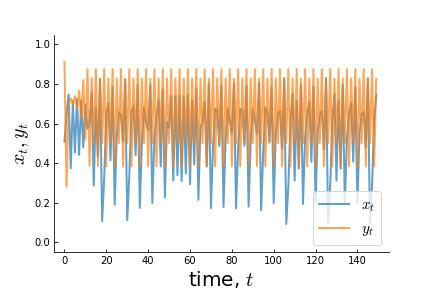

The optimal embedding dimension $E^\star$ can be computed via the pyEDM APIs and corresponds to $\max_{E}\rho$ corresponding to the red star displayed in the plot below. The numerical evaluation of $\max_E \rho$ tells us that $E^\star = 5$. However, it is clear (and safer) to assume $E^\star = 2$.

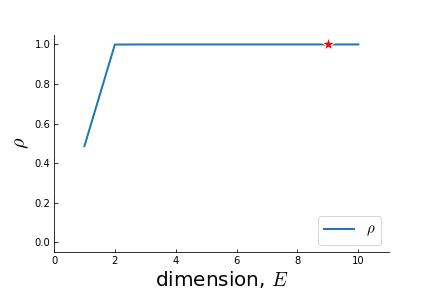

Using the whole extension of the time window, we get the following results:

| method | $X \rightarrow Y$ | $Y \rightarrow X$ |
|--: | --: | --: |
|  CCM  | 0.971 |  0.435 |
|   TE  | 0.704 | -0.176 |

**Note:** For CCM we use a value of $L = 148$ (i.e., the whole time series).

These results confirm us the tendency of CCM to return non negligible values of $\rho$ for non causal relationship (i.e., high false-positive ratio). If we compute CCM $\rho$ as a function of the library size, $L$, we get:

The above plot tells us that with a library size of $L \approx 40$ points, $\rho$ reaches (more or less) a plateau. This result hints that we can use a window size of 40 points to generate our time-varying networks. At the same time, given the extension of the Basa de la Mora dataset, and considering an overlap of 50% between time windows, our choice implies that we will deal with 5 or 6 snapshots at best.

If we now run 100 randomizations of the $X$ timeseries via methods 1 and 2 described above, and compute CCM with $L=40$ and TE we get:

| method | shuffling type  | reference value | $X \rightarrow Y$ | $p$-value |
|---:| ---: | ---: | ---: | ---: |
|CCM | 1 | 0.867 | $-0.003 \pm 0.062153$ | 0.00 |
|    | 2 |  | $0.759 \pm 0.025298$ | 0.01 |
| TE | 1 | 0.704 | $-0.011 \pm 0.159403$ | 0.00 |
|    | 2 |  | $0.133 \pm 0.189504$ | 0.00 |

These results demonstate us that we can "*safely*" use both CCM and TE to estimate causality in our data.

## References

<a id="1">[1]</a>
Holme, P., & Saramäki, J. *Temporal networks*. Phys. Rep., **519**, 97 (2012). 
DOI: https://doi.org/10.1016/j.physrep.2012.03.001

<a id='2'>[2]</a>
Hastie, T. J.; Tibshirani, R. J. *Generalized Additive Models*. Chapman & Hall/CRC, (1990). 
ISBN: 978-0-412-34390-2

<a id='3'>[3]</a>
Servén D., Brummitt C. *`pyGAM`: Generalized Additive Models in Python*. Zenodo, (2018). 
DOI: https://doi.org/10.5281/zenodo.1208723

<a id='4'>[4]</a>
`pyGAM` documentation. Available at: 
https://pygam.readthedocs.io/en/latest/index.html

<a id='5'>[5]</a>
Smoothing temporally correlated data. From: 
https://fromthebottomoftheheap.net/2011/07/21/smoothing-temporally-correlated-data/

<a id='6'>[6]</a>
Schwartzlose, R. A., et al. *Worldwide Large-Scale Fluctuations of Sardine and Anchovy Populations*. South African Journal of Marine Science **21**, 289, (1999).  
DOI: https://doi.org/10.2989/025776199784125962.

<a id='7'>[7]</a>
Modelling seasonal data with GAMs. From: 
https://fromthebottomoftheheap.net/2014/05/09/modelling-seasonal-data-with-gam/

<a id='8'>[8]</a>
Pérez-Sanz, A., et al. *Holocene climate variability, vegetation dynamics and fire regime in the central Pyrenees: the Basa de la Mora sequence (NE Spain)*. Quaternary Science Reviews, 73, **149** (2013). 
DOI: https://doi.org/10.1016/j.quascirev.2013.05.010

<a id='9'>[9]</a>
Sugihara, G., et al. *Detecting Causality in Complex Ecosystems*. Science, **338**, 496, (2012). 
DOI: https://doi.org/10.1126/science.1227079

<a id='10'>[10]</a>
Granger, C. W. J. *Investigating Causal Relations by Econometric Models and Cross-spectral Methods*. Econometrica, **37**, 424 (1969). 
DOI: https://doi.org/10.2307/1912791

<a id='11'>[11]</a>
Schreiber, T. *Measuring Information Transfer*.  Physical Review Letters, **85**, 461, (2000).  
DOI: https://doi.org/10.1103/PhysRevLett.85.461

<a id='12'>[12]</a>
Amblard, P. -O. et al. *The Relation between Granger Causality and Directed Information Theory: A Review*. Entropy, **15**, 113, (2013). 
DOI: https://doi.org/10.3390/e15010113 

<a id='13'>[13]</a>
Krakovská, A., et al. *Comparison of six methods for the detection of causality in a bivariate time series*. Physical Review E, **97**, 042207, (2018). 
DOI: https://doi.org/10.1103/PhysRevE.97.042207

<a id='14'>[14]</a>
Barraquand, F., et al. *Inferring species interactions using Granger causality and convergent cross mapping*. Theoretical Ecology, **14**, 87, (2021). 
DOI: https://doi.org/10.1007/s12080-020-00482-7

<a id='15'>[15]</a>
Kullback, S. *Information Theory and Statistics*, Wiley (New York), (1959).

<a id='16'>[16]</a>
Ikegwu, K. M., et al. *`PyIF`: A Fast and Light Weight Implementation to Estimate Bivariate Transfer Entropy for Big Data*, 2020 SoutheastCon, Raleigh (NC, USA), pp. 1-6, (2020). 
DOI: https://doi.org/10.1109/SoutheastCon44009.2020.9249650

<a id='17'>[17]</a>
Cobey, S., and Baskerville, E. B. *Limits to Causal Inference with State-Space Reconstruction for Infectious Disease*. PLOS ONE, **11**, e0169050 (2016). 
DOI: https://doi.org/10.1371/journal.pone.0169050
